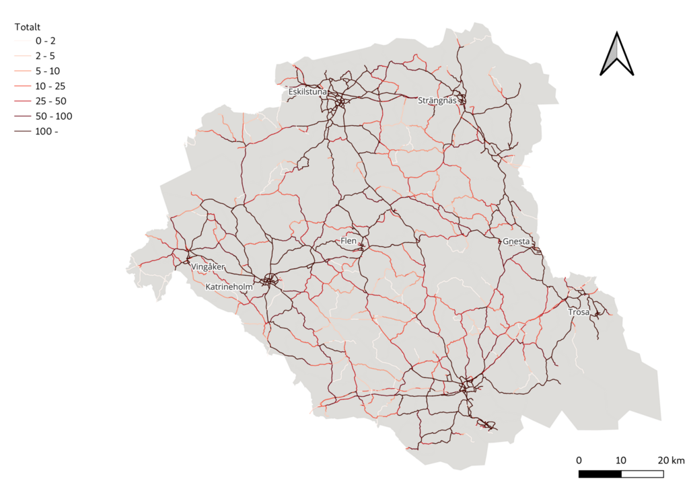

# Bicycle Planner QGIS Plugin

## Requirements

QGIS 3.20+
## Installation

Copy the `bicycle_planner` directory to your QGIS plugin directory (e.g. `$HOME/.local/share/QGIS/QGIS3/profiles/default/python/plugins/`).

## Usage

The plugin can be found in the Processing Toolbox under _Bicycle Planner -> Vector Processing -> Generate bicycle flow network_

The road _Network layer_ can be generated using the _Classify NVDB network_ algorithm. Its input is a homogenized road network from Trv [Lastkajen](https://lastkajen.trafikverket.se) with the following attributes.

- Driftbidrag statligt/Vägnr
- Funktionell vägklass/Klass
- Hastighetsgräns/Högsta tillåtna hastighet (Framriktningen)
- Hastighetsgräns/Högsta tillåtna hastighet (Bakriktningen)
- Trafik/ÅDT fordon
- Väghållare/Väghållartyp
- Vägtrafiknät/Nättyp

_Origins layer_ provides origin data which must have a size/population attribute and may have an additional weight attribute.

The _Destination layer_ should be a collection of OSM POI point geometries, that can be downloaded from https://download.geofabrik.se, and must have a feature class attribute that conforms to OSM POI values. These values are internally mapped into errand categories.

_Work place layer_ and _School layer_ are geometries with a size attribute.

When all layers an attributes are set a flow network can be calculated by running the algorithm.

## Calculate socio index and prepare origins

A Python script is provided in the `scripts/` directory that can be used to calculate socio-economic parameters and add them to origin geometries as attributes. The script developed to use Swedish DeSO areas and statistics from SCB for tah calculations.
